# LLM
`Large Language Models (LLMs)` are `advanced AI systems built on deep neural networks` designed to process, understand and generate human-like text.

- LLMs Learn patterns, grammar and context from text and can answer questions, write content, translate languages and many more.
- By using massive datasets and billions of parameters, LLMs have transformed the way humans interact with technology.
- Modern LLMs include ChatGPT (OpenAI), Google Gemini, Anthropic Claude, etc.

But LLMs have limitations:

- `Knowledge cutoff`: they only know what was in their training data. If you ask about something that happened after training, they won't know - or worse, they'll make something up.
- `No access to your data`: they can't see your documents, databases, or internal systems unless you provide that information.
- `Hallucinations`: they sometimes produce confident-sounding answers that are simply wrong.

## Working of LLM
LLMs are primarily based on the `Transformer architecture` which enables them to learn long range dependencies and contextual meaning in text. 

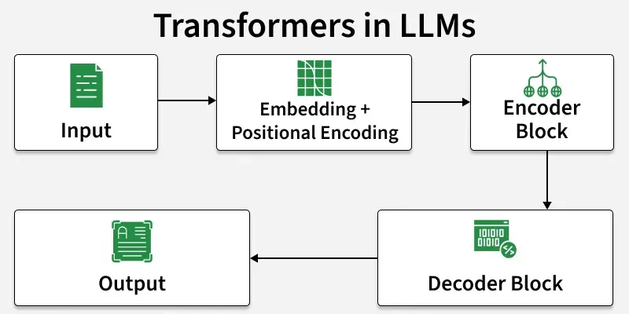

At a high level, they work through
- `Input Embeddings`: Converting text into numerical vectors.
- `Positional Encoding`: Adding sequence/order information.
- `Self-Attention`: Understanding relationships between words in context.
- `Feed-Forward Layers`: Capturing complex patterns.
- `Decoding`: Generating responses step by step.
- `Multi-Head Attention`: Parallel reasoning over multiple relationships.

## Input Embeddings

Word embeddings are numeric vector representations of words in a lower-dimensional space. They allow words with similar meanings to have similar representations, capturing semantic and syntactic information for use in machine learning models.

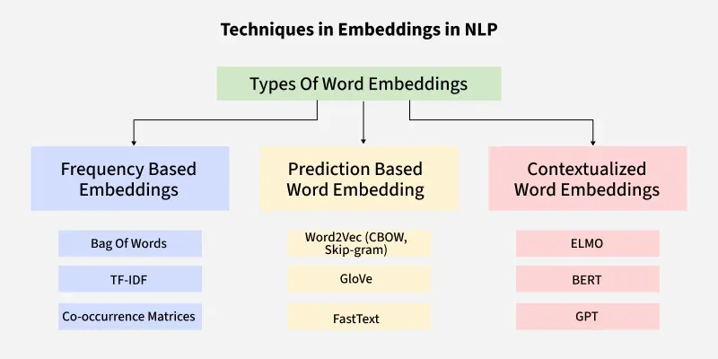

### Why are they needed?
- **Reduce dimensionality** compared to sparse representations like one-hot encoding.
- **Capture inter-word semantics and similarity**.
- Enhance model interpretability.
- Allow words to predict surrounding words.

### Main Approaches for Text Representation

**1. Traditional (Frequency-based) Approaches**
- **One-Hot Encoding**: Each word is a unique binary vector. **Disadvantages:** High-dimensional, memory-intensive, no semantic relationship capture.
- **Bag of Words (BoW)**: Represents a document by word frequencies. **Disadvantages:** Loses word order and context, sparse representations.
- **TF-IDF**: Weighs a word's importance based on its frequency in a document vs. its rarity across a corpus. **Disadvantages:** Cannot capture semantic relationships or context.

**2. Neural (Prediction-based) Approaches**
- **Word2Vec**: Uses shallow neural networks to create continuous vector spaces. Two main architectures:
    - **CBOW (Continuous Bag of Words)**: Predicts a target word from its surrounding context words.
    - **Skip-gram**: Predicts surrounding context words given a target word (better for rare words and semantic relationships).
- **GloVe (Global Vectors)**: Trained on global word-word co-occurrence statistics from a corpus.
- **FastText**: Extends Word2Vec by representing words as bags of character n-grams (handles out-of-vocabulary words and morphology).
- **BERT (Bidirectional Encoder Representations from Transformers)**: Creates **contextualized** embeddings by considering both left and right context. (Note: The article uses BERT to compute similarity between word pairs, but BERT embeddings are context-dependent, unlike static embeddings like Word2Vec or GloVe).

## Positional Encoding

Positional encoding is a technique that adds information about the **position of each token** in a sequence to the input embeddings. Since the Transformer model processes all tokens in parallel (not sequentially like RNNs), it lacks a built-in sense of order. Positional encoding solves this by injecting information about the absolute or relative position of tokens, enabling the model to understand sentence structure and differentiate between words in different positions.

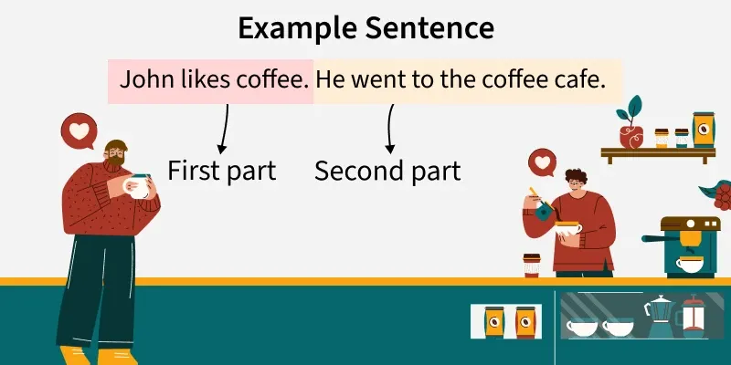
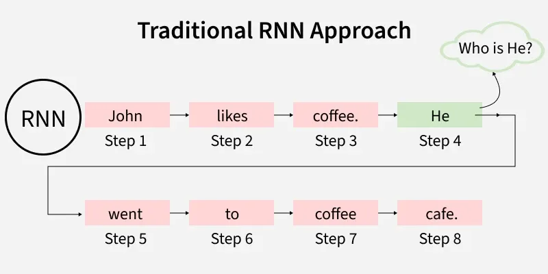
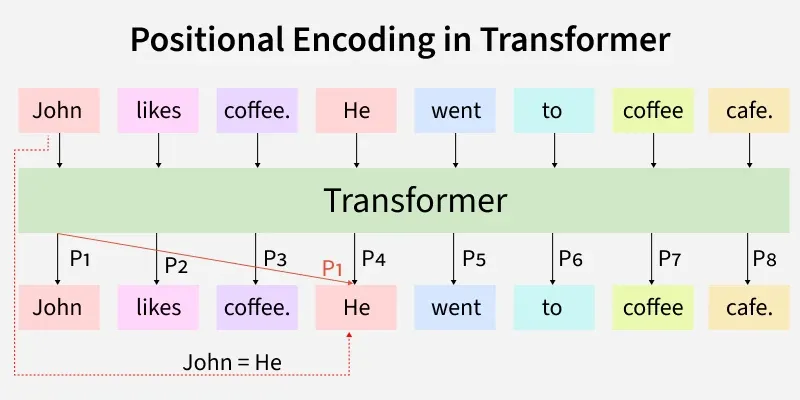

## Self-Attention

`Self-attention` helps a model understand how words in a sentence are related to each other. It allows the model to look at all words at the same time and decide which ones are `important` for understanding the meaning of each word. Because of this, self-attention captures context more effectively and plays a key role in models like Transformers.

- Attention helps models `focus on the most important words` in a sentence, similar to how humans understand language.
- Traditional RNN encoder–decoder models compress input into a single vector, which can `lose important information`.
- It handles long-range dependencies more effectively than traditional sequential models.

`Attention` is a mechanism that helps a `model focus on the most relevant parts of the input when processing information`. It assigns importance to different elements so the model can better understand context and meaning.

## Feed-Forward Layers

### What is a Feedforward Neural Network?
An FNN is a type of artificial neural network where information flows in **one direction only**—from the input layer, through hidden layers, to the output layer—without any loops or feedback. It is mainly used for pattern recognition tasks like image and speech classification.

### Structure
An FNN has a layered design:
- **Input Layer**: Neurons represent each feature of the input data.
- **Hidden Layers** (one or more): Responsible for learning complex patterns. Each neuron applies a weighted sum of inputs followed by a **non-linear activation function**.
- **Output Layer**: Provides the final output (e.g., class probabilities or regression values).

### Key Concepts

**Activation Functions** (introduce non-linearity):

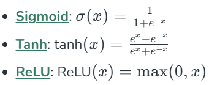

**Training Process** (using backpropagation and gradient descent):
1.  **Forward Propagation**: Input passes through the network to calculate the output.
2.  **Loss Calculation**: Error is computed using a loss function (e.g., Mean Squared Error for regression, Cross-Entropy for classification).
3.  **Backpropagation**: Error is propagated backward to update the weights by calculating gradients.

**Gradient Descent**
`Gradient Descent` is an `optimization algorithm` used to `minimize the loss function` by iteratively updating the weights in the direction of the negative gradient. 
**Gradient Descent Variants**:
- **Batch Gradient Descent**: Uses the entire dataset.
- **Stochastic Gradient Descent (SGD)** : Uses one training example at a time.
- **Mini-batch Gradient Descent**: Uses a small batch of examples.

### Evaluation Metrics
- **Accuracy**: Proportion of correct predictions.
- **Precision & Recall**
- **F1 Score**: Harmonic mean of precision and recall.
- **Confusion Matrix**: Shows true/false positives and negatives.

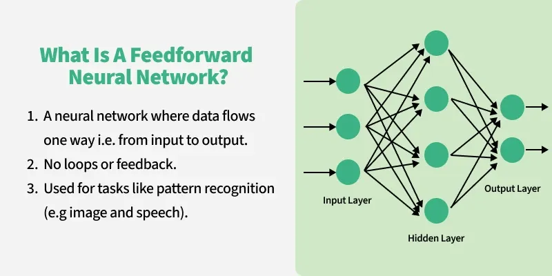
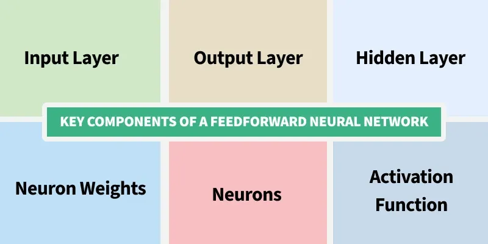
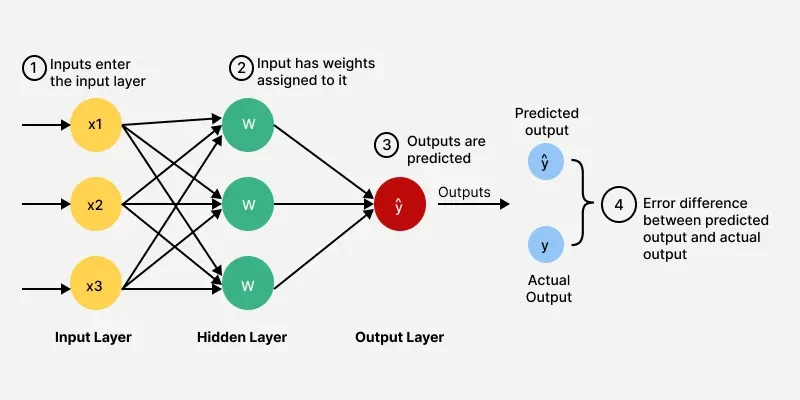
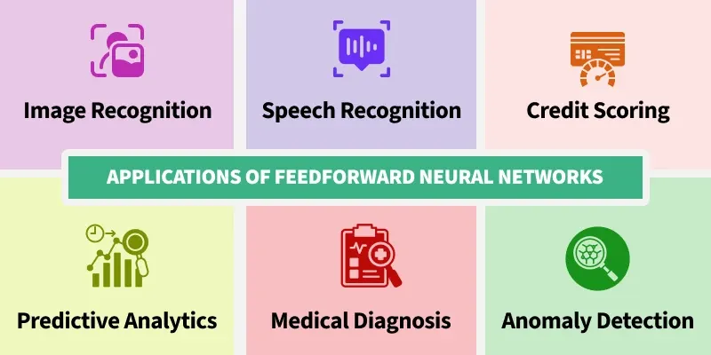

## Decoding

### What is an Encoder-Decoder Model?
It is a neural network architecture used for tasks where both the input and output are **sequences of possibly different lengths** (e.g., machine translation, text summarization, speech processing). The model consists of two main parts:
- **Encoder**: Processes the input sequence and converts it into a fixed representation called the **context vector**.
- **Decoder**: Uses the context vector to generate the output sequence step by step.

### Architecture and Working

**Encoder** (typically an RNN or LSTM):
- Processes input tokens sequentially and updates its hidden state.
- Captures relationships between words.
- Produces final hidden and cell states which form the **context vector** (a summary of the entire input).

**Decoder** (typically an RNN or LSTM):
- Uses the context vector from the encoder to initialize its own states.
- Generates output one token at a time, using the previous output and the context to predict the next token.
- Continues until an end-of-sequence token is produced.

**Step-by-step example** (translating "I am learning AI"):
1. **Tokenize** the input sentence into words.
2. **Encode** the embeddings sequentially using an LSTM to produce a context vector.
3. **Pass** the context vector to the decoder.
4. **Decoder generates** output step-by-step (each step depends on previous outputs and the context).
5. **Attention mechanism** (optional but important): Helps the decoder focus on different parts of the input at each step, improving performance on long sequences.

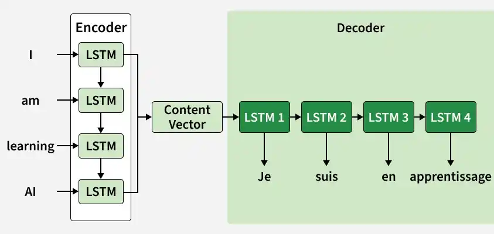

## Multi-Head Attention

It is a core component of the Transformer architecture (from the 2017 paper "Attention Is All You Need"). It extends the standard self-attention mechanism by using **multiple attention heads in parallel**, allowing the model to simultaneously focus on different parts of an input sequence and capture diverse types of relationships.

### Why Use Multiple Heads?
- **Captures different relationships**: Different heads learn to attend to different aspects (e.g., syntactic, semantic, positional).
- **Improves learning efficiency**: Parallel processing allows better learning of dependencies.
- **Enhances robustness**: Reduces reliance on a single attention pattern, helping prevent overfitting.

